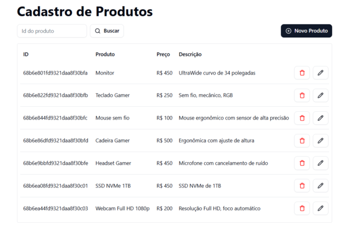
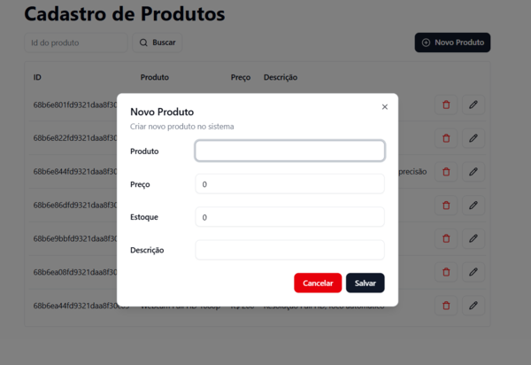

# 🛒 CRUD de Produtos

Aplicação **Fullstack** para gerenciamento de produtos, desenvolvida com **Fastify, Prisma e TypeScript** no backend e **React + Vite + Shadcn UI** no frontend.  

## 🚀 Tecnologias

### Backend
- [Fastify](https://fastify.dev/) — Framework web rápido e eficiente
- [Prisma](https://www.prisma.io/) — ORM para banco de dados
- [TypeScript](https://www.typescriptlang.org/) — Tipagem estática
- [tsx](https://github.com/esbuild-kit/tsx) — Execução de TS sem build manual
- [@fastify/cors](https://github.com/fastify/fastify-cors) — Suporte a CORS

### Frontend
- [React](https://react.dev/) — Biblioteca para interfaces
- [Vite](https://vitejs.dev/) — Bundler moderno e rápido
- [TypeScript](https://www.typescriptlang.org/)
- [shadcn/ui](https://ui.shadcn.com/) — Componentes de UI modernos e estilizados
- [Tailwind CSS](https://tailwindcss.com/) — Utilitário CSS
- [pnpm](https://pnpm.io/) — Gerenciador de pacotes rápido e eficiente


## ⚙️ Configuração

### 🔹 1. Clonar o repositório
```
  git clone https://github.com/seu-usuario/crud-produtos.git
  cd crud-produtos
```

🔹 2. Rodar o Backend
```
cd backend
npm install
npx prisma migrate dev   # cria e aplica as migrations
npm run dev              # inicia o servidor Fastify
```

Servidor rodará por padrão em:
👉 http://localhost:8080

🔹 3. Rodar o Frontend (com pnpm)
```
cd frontend
pnpm install
pnpm run dev
```

Interface acessível em:
👉 http://localhost:5173

## 🛠️ Funcionalidades

✅ Criar produtos

✅ Listar produtos

✅ Atualizar produtos

✅ Excluir produtos

✅ Interface responsiva e moderna

## 📸 Screenshots

### Tela principal



### Tela de cadastro


### 📌 Observações

Configure o banco de dados no arquivo backend/prisma/schema.prisma.

Certifique-se de rodar as migrations antes de iniciar o backend.

## 🧑‍💻 Desenvolvido por

- Vitor de Souza Ramos
- Estudante de Ciência da Computação na UNESC
- [GitHub](https://github.com/vitor-sramos).
- [LinkedIn](https://www.linkedin.com/in/vitor-ramos-934302349).
